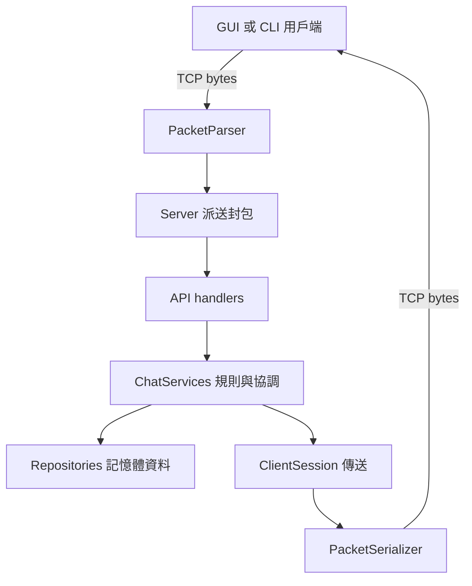
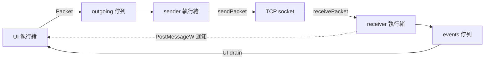
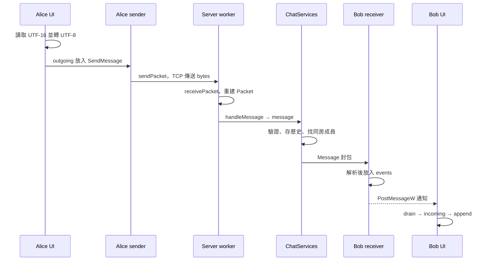

# 從 C++ 到 Winsock 圖形聊天室：技術原理與 GUI 實作教科書

> 適合對象：會使用 C++ 變數、函式、類別與基本容器，但沒有網路通訊與 Windows GUI 經驗的讀者。
>
> 本文對照本專案現有程式碼撰寫。你將學會的不只是「呼叫哪個函式」，而是每一層為什麼存在、資料如何流動，以及出了問題要去哪裡找原因。
>
> 閱讀基準：`TCPIP-HW/HW1`。本文的相對連結都以這個目錄為起點。標示為「教學簡化」的片段只用來解釋概念，不能直接取代正式程式中的檢查與清理。

## 學習地圖

建議分四次閱讀：第一次讀第 1～6 章，理解資料如何跨電腦；第二次讀第 7～10 章，理解伺服器；第三次讀第 11～16 章，理解 GUI；最後讀第 17～21 章，做實驗並整理觀念。不必第一次就記住 OLE 或所有 Win32 函式。

1. [先讓聊天室跑起來](#lesson-01)
2. [兩個程式怎麼交換資料](#lesson-02)
3. [IP、port、socket 與 client/server](#lesson-03)
4. [TCP 是位元組串流，不是一封封信](#lesson-04)
5. [設計自己的聊天室通訊協定](#lesson-05)
6. [序列化與解析：把 C++ 資料變成 bytes](#lesson-06)
7. [執行緒、共享資料與 mutex](#lesson-07)
8. [伺服器如何接客、工作與關機](#lesson-08)
9. [專案分層與各檔案的責任](#lesson-09)
10. [登入、房間與訊息的完整流程](#lesson-10)
11. [GUI 的基礎：視窗與事件迴圈](#lesson-11)
12. [控制項、App 狀態與輸入文字](#lesson-12)
13. [asset 背景、繪圖、縮放與資源生命週期](#lesson-13)
14. [讓網路工作不堵住 GUI](#lesson-14)
15. [檔案傳輸、下載與 .bin](#lesson-15)
16. [圖片如何真的出現在聊天區](#lesson-16)
17. [追蹤一句話從 Alice 到 Bob](#lesson-17)
18. [CMake 如何把這些檔案變成程式](#lesson-18)
19. [測試、觀察與除錯方法](#lesson-19)
20. [目前限制與下一步設計](#lesson-20)
21. [練習、解答與名詞表](#lesson-21)

---

<a id="lesson-01"></a>
## 1. 先讓聊天室跑起來

先觀察結果，再研究內部。這會讓後面的 socket、封包與事件迴圈有具體對象。

### 1.1 建置與執行是不同的事情

- **建置（build）**：編譯 `.cpp`，再連結成 `.exe`。修改 C++ 後通常需要重新建置。
- **執行（run）**：啟動已建好的 `.exe`。重開電腦不會刪掉執行檔，不必因為重開機就重新編譯。
- **伺服器與用戶端是不同程式**：只開 GUI 不代表伺服器已經在工作。

本機目錄與工具鏈對應的 PowerShell 指令如下：

```powershell
cd D:\vcode\TCPIP-HW
cmake -S HW1 -B HW1/build -G "MinGW Makefiles" -DCMAKE_CXX_COMPILER=D:/msys2/ucrt64/bin/g++.exe
cmake --build HW1/build -j 4
```

`-S` 是原始碼目錄；`-B` 是產物目錄；`-G` 指定產生哪一種建置系統。這裡的編譯器路徑是本機設定，搬到其他電腦時需改成該電腦實際安裝位置。CMake 與 MinGW 的工具必須可被目前環境找到。

**不要混用專案搬家前的 build 目錄。** CMake 快取記錄了來源路徑、產物路徑與編譯器；本教學統一使用 `HW1/build`。IDE 裡另外儲存的舊路徑不會因為這些指令而自動修正。

第一個 PowerShell 視窗啟動伺服器：

```powershell
cd D:\vcode\TCPIP-HW
.\HW1\build\chat_server.exe
```

第二個視窗啟動 GUI：

```powershell
cd D:\vcode\TCPIP-HW
.\HW1\build\gui\chat_gui.exe
```

再啟動一份 GUI，兩個視窗分別使用 `Alice`、`Bob` 登入，位址都填 `127.0.0.1`，port 填 `9000`。預設進入 `lobby`，Alice 傳送文字後，兩邊都應看到訊息。也可以用命令列用戶端：

```powershell
.\HW1\build\chat_client.exe Alice
```

### 1.2 先做三個觀察

1. 關掉伺服器，GUI 就無法繼續透過它聊天。
2. Alice 建立新房間後，還需要加入房間；建立與加入是兩個操作。
3. Alice、Bob 在不同房間時，不會收到彼此的新聊天訊息。

這代表聊天室不是兩個輸入框直接互相複製文字。中間存在連線、規則檢查與轉送邏輯。

---

<a id="lesson-02"></a>
## 2. 兩個程式怎麼交換資料

### 2.1 另一個程式看不到你的變數

假設 Alice 的用戶端有：

```cpp
std::string text = "Hello";
```

這個物件存在 Alice 程式的記憶體裡。Bob 的程式不會因為也宣告了 `text` 就取得相同內容。即使兩個程式在同一台電腦，它們仍然是不同的行程（process），各自管理自己的記憶體。

若要交換資料，需要約定一個傳送方式。本專案選擇網路 socket，使用 Windows 的 Winsock API。

```text
Alice 的 C++ 物件
    ↓ 編碼成 bytes
Alice 的 socket
    ↓ Windows 的 TCP/IP 功能
伺服器的 socket
    ↓ 解碼與檢查
伺服器的 C++ 物件
    ↓ 決定收件者，重新編碼
Bob 的 socket
    ↓ 解碼
Bob 的聊天畫面
```

中間傳送的是**位元組（byte）**，不是 C++ 物件本身。一個 byte 有 8 個 bit，可以表示 0～255。

### 2.2 分清楚三種「訊息」

| 名稱 | 所在位置 | 在本專案中的例子 |
|---|---|---|
| 聊天內容 | 使用者想表達的資料 | `大家好` |
| 聊天室協定封包 | 用戶端與伺服器約定的資料格式 | `SendMessage` 加上一個文字欄位 |
| Windows 視窗訊息 | Windows 通知視窗發生事件 | `WM_PAINT`、`WM_COMMAND` |

另外，網路書籍裡會說 TCP segment、IP packet。它們是更底層的傳輸單位，不能直接等同於本文的 `chat::Packet`。

你負責定義聊天室資料；Windows 負責 TCP/IP 的實作。本專案沒有自己手寫 TCP 的重傳或封包排序演算法。

---

<a id="lesson-03"></a>
## 3. IP、port、socket 與 client/server

### 3.1 先用地址的概念理解

可以先把 IP 想成主機的網路地址，把 port 想成該主機上某個服務的入口編號。但這只是入門比喻：實際上一台主機可能有多個網路介面與位址。

- `127.0.0.1`：回送位址，指**目前這台電腦自己**。
- `192.168.x.x`：常見的區域網路私有位址，實際值由網路設定決定。
- `9000`：本專案預設 TCP port，不是聊天室房間編號。
- `0.0.0.0`：本專案用於伺服器 `bind` 時，表示監聽所有本機 IPv4 介面；不要把它當成遠端用戶端應填的伺服器地址。

如果 Bob 在另一台電腦輸入 `127.0.0.1`，他連的是 **Bob 自己**，不會連到 Alice 的電腦。

### 3.2 socket 不是 IP 位址

`SOCKET` 是 Windows 提供給程式的操作代號。你使用它呼叫 `send`、`recv`、`closesocket`。它不是可以寄給朋友當作連線地址的號碼。

一條 TCP 連線可以由本機 IP、本機 port、遠端 IP、遠端 port 來區分。用戶端一般讓系統自動選擇本機暫用 port，所以多位用戶可以同時連到伺服器的同一個 `9000` port。

### 3.3 誰是 server，誰是 client？

**Server 主動等待連線；client 主動發起連線。** 這是程式角色，不是電腦等級。一台筆電可以同時執行伺服器與兩份用戶端。

```text
伺服器：socket → bind → listen → accept → recv / send
用戶端：socket → connect              → send / recv
```

- `socket`：建立通訊端點。
- `bind`：指定伺服器要在哪個本機位址與 port 等待。
- `listen`：把 socket 設為監聽用途。
- `accept`：接受一位用戶，回傳**另一個**已連線 socket。
- `connect`：用戶端向伺服器建立 TCP 連線。

監聽 socket 繼續接待新用戶；`accept` 回傳的 socket 專門和這位用戶交換資料。不要拿監聽 socket 當作全體聊天資料的收發管道。

### 3.4 朋友能否直接連上我的 client？

目前的 GUI 只有對外 `connect`，沒有 `listen`、`accept` 或伺服器的轉送邏輯，所以朋友無法把它當作伺服器連入。現有做法是：你執行 server，大家的 client 都連向它。

若要做「在 GUI 按一下建立主機」，可以讓 GUI 啟動或整合 server，但那是額外功能。跨網際網路還可能涉及路由器 NAT、防火牆與公網可達性；把 bind 改為 `0.0.0.0` 本身不會處理這些事情。

---

<a id="lesson-04"></a>
## 4. TCP 是位元組串流，不是一封封信

### 4.1 最重要的觀念：send 與 recv 沒有一對一關係

假設 Alice 執行兩次：

```cpp
send(socket, "ABC", 3, 0);
send(socket, "DEF", 3, 0);
```

以下任一接收方式都有可能：

```text
一次 recv：ABCDEF
兩次 recv：ABC | DEF
三次 recv：A | BCDE | F
```

應用程式看到的是有順序的 byte stream。一次 `send` 不會替接收端保留「這是第一封信」的邊界。接收 buffer 的大小也只是上限，不是要求這次一定填滿。

因此不能寫「呼叫一次 `recv`，就當作收到一整個聊天封包」。這是初學者最容易在本機測試成功、換個網路環境就失敗的原因。

### 4.2 TCP 保證了什麼？

在連線正常運作時，TCP 提供有序、可靠的位元組傳輸；底層遺失或順序問題由 TCP 處理。發生無法恢復的故障時，連線仍可能失敗。

TCP 不替你決定：

- 哪些 bytes 是暱稱，哪些是圖片。
- 一則聊天訊息在哪裡結束。
- 使用者是否登入、是否有權加入房間。
- 訊息是否已顯示在 Bob 的螢幕或永久寫入資料庫。
- 資料是否加密。本專案的普通 TCP 連線沒有 TLS 加密。

`send` 成功只表示相應 bytes 被本機傳送機制接受，不能當成「Bob 已讀」。需要已讀功能，就得另設應用層回覆。

### 4.3 recv 的三種結果

| 結果 | 意義 | 程式應對 |
|---|---|---|
| 大於 0 | 這次收到的 byte 數 | 累積到 buffer |
| 等於 0 | 對方正常結束傳送，且可讀資料已耗盡 | 結束接收流程 |
| `SOCKET_ERROR` | 發生錯誤 | 可用 `WSAGetLastError()` 查原因，結束或依設計處理 |

阻塞式 `recv` 在沒有資料時會等待。這解釋了為什麼不能在 GUI 的按鈕事件內一直 `recv`。

相關 API 的精確行為可查閱 Microsoft 的 [recv 文件](https://learn.microsoft.com/en-us/windows/win32/api/winsock2/nf-winsock2-recv)與 [send 文件](https://learn.microsoft.com/en-us/windows/win32/api/winsock2/nf-winsock2-send)。

---

<a id="lesson-05"></a>
## 5. 設計自己的聊天室通訊協定

### 5.1 「協定」就是雙方遵守的規則

協定不是神祕的套件。只要雙方約定「先傳什麼、每個欄位多長、收到後做什麼」，就是通訊協定。

本專案在 TCP 上設計了自己的二進位格式。記憶體中的表示方式見 [Packet.h](include/protocol/Packet.h)：

```cpp
// 核心結構；省略 namespace 與 include。
struct Packet {
    PacketType type;
    std::vector<std::string> fields;
};
```

例如：`{PacketType::Login, {"Alice"}}` 表示登入；`{PacketType::SendMessage, {"Hello"}}` 表示傳送文字。

`fields` 的意義依 `type` 決定，不能只看字串猜操作。傳文字與建立房間，即使都只帶一個字串，仍然是兩種不同封包。

### 5.2 固定 12 bytes 的表頭

定義見 [PacketHeader.h](include/protocol/PacketHeader.h)。

| 起始位置 | 大小 | 欄位 | 內容 |
|---|---:|---|---|
| 0 | 4 bytes | magic | `0x43484154`，對應 ASCII `CHAT` |
| 4 | 2 bytes | version | 目前為 `1` |
| 6 | 2 bytes | type | 封包種類 |
| 8 | 4 bytes | payload size | 後面本文的總 byte 數，不含這 12 bytes |

收件端先收滿 12 bytes，就知道接下來還要收多少 bytes。這稱為**長度前綴（length prefix）**的封包切分方法。

magic 用來辨識預期格式；version 用來辨識支援的版本。兩者都不是密碼、身分驗證或加密。

### 5.3 本文是多個「長度＋資料」

每個欄位都是：

```text
[4 bytes：欄位資料長度][該欄位的原始 bytes]
```

多個欄位接在一起。沒有額外的「欄位總數」欄位，解析器一直讀到 payload 結尾；目前最多允許 16 個欄位。

```text
header 12 bytes
└─ payload
   ├─ length 4 bytes → field 1
   ├─ length 4 bytes → field 2
   └─ ...直到 payload 用完
```

封包總大小計算：

```text
payload 大小 = Σ（4 + 每個欄位的 byte 數）
封包總大小  = 12 + payload 大小
```

沒有欄位的命令，其 payload 是 0 bytes。這與「有一個長度為 0 的欄位」不同：後者仍需要 4 bytes 存放長度。

### 5.4 整數的 byte 順序

十六進位 `0x00000009` 代表整數 9，但在不同電腦的記憶體中，byte 排列方式不一定相同。協定必須約定順序。

本專案採用 network byte order，也就是大端序（big-endian）：

```text
數值 9 的 u32 網路表示：00 00 00 09
```

Winsock 提供：

| 函式 | 意義 |
|---|---|
| `htons` | 主機順序的 16-bit 整數 → 網路順序 |
| `htonl` | 主機順序的 32-bit 整數 → 網路順序 |
| `ntohs` | 網路順序的 16-bit 整數 → 主機順序 |
| `ntohl` | 網路順序的 32-bit 整數 → 主機順序 |

這只處理整數欄位。不要把文字或整張圖片的 byte 順序反轉。

### 5.5 手算一個真實封包

登入暱稱 `Alice`，ASCII／UTF-8 都是 5 bytes。

```text
payload = 4 + 5 = 9 bytes
整個封包 = 12 + 9 = 21 bytes

43 48 41 54 | 00 01 | 00 01 | 00 00 00 09 | 00 00 00 05 | 41 6C 69 63 65
   CHAT    |版本 1 | Login | payload=9 | 欄位長度=5 |      Alice
```

不要把上面的十六進位文字當作實際傳送的字串。真正傳的是 21 個 bytes，不是含空白與 `|` 的這一行文字。

### 5.6 UTF-8 長度不等於中文字數

`你好` 的 UTF-8 bytes 是：

```text
E4 BD A0 E5 A5 BD
```

它是 2 個中文字，但占 6 bytes。若作為唯一欄位，payload 是 `4 + 6 = 10`，整個封包是 `22` bytes。

C++ 的 `std::string::size()` 在這裡回報 byte 數，不是人眼看到的字數。因此 4096 bytes 的聊天上限，不保證容納 4096 個中文字。

### 5.7 所有封包種類

完整定義見 [PacketType.h](include/protocol/PacketType.h)。下表的欄位順序就是雙方約定。

| 值 | 名稱 | 主要方向 | fields |
|---:|---|---|---|
| 1 | Login | client → server | 暱稱 |
| 2 | ListRooms | client → server | 無 |
| 3 | CreateRoom | client → server | 房間名稱 |
| 4 | JoinRoom | client → server | 房間名稱 |
| 5 | LeaveRoom | client → server | 無 |
| 6 | SendMessage | client → server | 文字 |
| 7 | History | client → server | 無 |
| 8 | SendFile | client → server | 原檔名、檔案 bytes |
| 100 | Ok | server → client | 狀態說明 |
| 101 | Error | server → client | 錯誤說明 |
| 102 | Rooms | server → client | 一個字串，內含以換行分隔的房間名稱 |
| 103 | Message | server → client | 房間、發送者、文字、時間戳字串 |
| 104 | File | server → client | 房間、發送者、原檔名、檔案 bytes |

特別注意：`SendMessage` 是請求；`Message` 是伺服器發送的訊息資料。用戶端不需要自行提供「我是誰」和「我在哪個房間」，因為伺服器的 session 已經記錄這些資訊。

---

<a id="lesson-06"></a>
## 6. 序列化與解析：把 C++ 資料變成 bytes

### 6.1 為什麼不能直接 send(&packet, sizeof(packet))？

`std::string`、`std::vector` 內含管理資訊與指標。指標只對目前程式的記憶體有意義。把它傳到另一台電腦，不會自動把指向的文字一起搬過去。

此外，C++ 結構可能有 padding，且不同編譯器的物件配置不必相同。因此我們傳的是自己定義的 bytes，而不是物件記憶體快照。

**序列化**是物件 → 可傳送 bytes；**解析／反序列化**是 bytes → 可使用的物件。

### 6.2 序列化的工作順序

閱讀 [PacketSerializer.cpp](service/protocol/PacketSerializer.cpp)，先找 `encodePacket`。

1. 檢查欄位數上限。
2. 對每個欄位，附加轉為網路順序的 4-byte 長度。
3. 附加欄位內容，包含可能出現的 `\0`。
4. 檢查 payload 大小。
5. 產生 12-byte header，再接上 payload。

`std::string` 可以保存二進位資料。`std::string("A\0B", 3)` 的大小是 3；但只用 C 字串結尾規則的函式可能在中間的 `\0` 提早停止。處理檔案時一定要保留明確長度。

### 6.3 sendPacket 必須處理只送出一部分

下列是教學簡化，實際實作見同一檔案：

```cpp
size_t offset = 0;
while (offset < bytes.size()) {
    int n = send(socket, bytes.data() + offset,
                 static_cast<int>(bytes.size() - offset), 0);
    if (n <= 0) return false;
    offset += static_cast<size_t>(n);
}
return true;
```

假設總共 21 bytes，第一次 `send` 回傳 8，第二次就要從位置 8 開始送剩下 13 bytes。若又從位置 0 開始，接收端會收到重複資料。

本專案限制封包大小，因此這裡傳給 Winsock 的 `int` 長度在可表示範圍內。若未來允許超大型 buffer，還需要分批控制長度，不能任意縮窄整數型別。

### 6.4 receiveExact：先確定資料真的收齊

閱讀 [PacketParser.cpp](service/protocol/PacketParser.cpp)。以下是對其做法的教學簡化：

```cpp
bool receiveExact(SOCKET socket, char* buffer, size_t remaining) {
    while (remaining > 0) {
        int n = recv(socket, buffer, static_cast<int>(remaining), 0);
        if (n <= 0) return false;
        buffer += n;       // 下一批放在已收資料的後面
        remaining -= n;    // 更新還缺多少 bytes
    }
    return true;
}
```

如果要收 12 bytes，而每次取得 3、5、4，狀態如下：

| 時機 | 已收到 | 還需要 | 下一次寫入位置 |
|---|---:|---:|---:|
| 開始 | 0 | 12 | buffer + 0 |
| 第一次後 | 3 | 9 | buffer + 3 |
| 第二次後 | 8 | 4 | buffer + 8 |
| 第三次後 | 12 | 0 | 完成 |

封包剩下一半時斷線，不是成功收到一個「比較短的封包」；這次解析必須失敗。

### 6.5 receivePacket 的檢查順序

```text
收滿 12-byte header
  → 檢查 magic、version
  → 檢查 payload 長度上限
  → 配置 payload buffer
  → 收滿 payload
  → 逐欄位讀長度與內容
  → 得到 Packet
```

目前 `MaxPayload = 1024 * 1024 + 4096`。必須先檢查再配置記憶體，否則遠端只要宣稱「我要傳幾十億 bytes」，就可能讓程式嘗試配置不合理的空間。

每次解析欄位之前，還要確認：

- 至少剩 4 bytes 可以讀長度。
- 欄位數不超過 16。
- 宣告的欄位長度不大於 payload 中實際剩餘大小。

讀整數時，程式使用 `memcpy` 複製到整數變數，再做 `ntohl`／`ntohs`。這避免直接把未必對齊的 byte 指標強制轉成整數指標來解參考。

格式錯誤時接收流程失敗並關閉連線。格式正確、但種類不認得的封包，則交由伺服器派送邏輯回報錯誤。**格式合法**與**操作合法**是兩層不同檢查。

---

<a id="lesson-07"></a>
## 7. 執行緒、共享資料與 mutex

### 7.1 為什麼一個迴圈不夠？

若伺服器只這樣寫：

```cpp
// 錯誤設計示意：服務第一位用戶時，不能繼續 accept。
auto client = accept(listener, nullptr, nullptr);
while (receivePacket(client, packet)) {
    handle(packet);
}
```

第一位用戶一直不斷線，程式就一直在這個迴圈裡，無法接受第二位用戶。現有程式使用多執行緒，把「接受新連線」與「服務每一位用戶」分開。

執行緒（thread）可以想成同一程式裡多條執行路徑。它們共享記憶體，所以交換資料方便，但同時修改資料會造成競爭。

### 7.2 data race 不是只有數字加錯

兩個工作執行緒同時操作同一個 `std::vector`，其中一個剛好擴充容量，另一個仍拿舊位置讀取，就可能出現未定義行為。不是「偶爾顯示錯字」這麼簡單。

本專案使用 `std::mutex` 建立互斥區：

```cpp
// 教學示意：同一時間只允許一條執行緒操作這段共享資料。
{
    std::lock_guard<std::mutex> lock(mutex);
    sharedData.push_back(value);
} // 離開作用域，lock_guard 自動解鎖
```

這是 RAII 的例子：把資源取得與釋放綁定到物件生命週期。即使中途丟出例外，區域物件仍會清理。

### 7.3 這個專案有不同用途的鎖

| 保護對象 | 鎖的位置 | 為什麼需要 |
|---|---|---|
| 使用者、房間、歷史與 session 狀態 | `ChatServices::mutex_` | 多位用戶可能同時登入、換房或發訊息 |
| 同一條 socket 的完整封包寫入與關閉 | `ClientSession::sendMutex` | 多個房間成員的 worker 可能同時對同一收件者送資料 |
| GUI 的送出／事件佇列與連線狀態 | `GuiConnection::mutex_` | UI、sender、receiver 共用資料 |

為什麼送資料也要鎖？因為 `sendPacket` 可能需要多次 `send`。若兩條執行緒交錯寫入同一 socket，可能變成「A 的 header、B 的 header、A 的 body」，接收端就無法按照協定解析。鎖必須涵蓋一整個應用層封包的寫入流程。

### 7.4 shared_ptr 與 atomic 各自解決什麼？

`std::shared_ptr<ClientSession>` 讓多個位置共同持有 session，直到最後一個持有者釋放時才銷毀物件。它解決的是**生命週期**，不會自動讓 `session->room` 的讀寫變成執行緒安全。

`std::atomic<bool>` 適合表示「是否停止」這類單一共享旗標。它避免旗標本身的資料競爭，但不能把多個容器操作一起變成不可分割的交易。

最後，`thread.join()` 是等待執行緒跑完，不是強制把它殺掉。若執行緒卡在 `recv`，只是把停止旗標改成 true，並不能保證它立刻醒來。

---

<a id="lesson-08"></a>
## 8. 伺服器如何接客、工作與關機

閱讀入口：[main.cpp](main.cpp)、[Server.cpp](service/Server.cpp)、[ClientSession.h](domain/ClientSession.h)。

### 8.1 啟動順序

1. `WSAStartup` 初始化 Winsock。
2. 讀取 port 與監聽位址；預設為 `0.0.0.0:9000`，監聽所有本機 IPv4 介面。
3. 建立執行 `Server::run` 的執行緒。
4. `Server::run` 建立 socket、bind、listen。
5. 初始化成功後，透過 `promise` 通知主執行緒。
6. 主執行緒等待使用者輸入 `/quit`；server 執行緒持續接受新連線。

`std::promise`／`std::future` 可以先理解成一次性的通知機制：一端放入完成結果，另一端的 `get()` 等待結果。本專案也用它把初始化例外帶回主執行緒，避免 bind 失敗後主程式還表現得像已啟動。

### 8.2 實際上有哪些執行緒？

```text
main 執行緒：等待 console 指令
server 執行緒：監聽 socket，accept 新連線，回收已完成 worker
client worker A：讀取 Alice 封包 → 執行服務
client worker B：讀取 Bob 封包   → 執行服務
...
```

目前工作執行緒數量有 64 個的上限。這是此程式的限制，不是 TCP 的理論上限。已完成的 worker 會被 join 並從清單移除。

監聽迴圈使用 `select` 搭配約 200 ms 的等待時間，定期回頭檢查停止旗標。這裡的 `select` 用來等「監聽 socket 有沒有事情可處理」，不是讓主執行緒每次都忙著空轉。

### 8.3 一個 client worker 的工作

```text
receivePacket
  → 根據 PacketType 選擇 handler
  → handler 呼叫 ChatServices
  → 檢查規則／更新 repository／回覆或轉送
  → 回到 receivePacket
```

連線結束後，`detach` 解除使用者登記並移除 session，再關閉 socket。暱稱因此可供下一位使用者重新使用。

連線設有傳送約 3 秒、接收約 300 秒的 socket timeout。這些是 socket 操作的等待設定，**不能直接理解成整個封包一定在該時間內收完**；封包可能需要多次 `recv`。

### 8.4 關機為什麼要按順序？

```text
main 要求停止
  → 監聽迴圈離開
  → 關閉 listener，不再接受新用戶
  → interruptAll 關閉各 session 的 socket
  → 阻塞中的接收工作結束
  → join 所有 worker
  → main 完成 join
  → WSACleanup
```

若先等待 worker 結束、卻沒有中斷 socket，沒有發言的用戶就可能讓關機停在等待中。

`shutdown` 和 `closesocket` 是網路資源的關閉操作；`join` 是執行緒的等待操作，兩者不能互相取代。現有關機方式以取消工作、釋放資源為主，並沒有實作「確保所有尚未送出的聊天訊息都收到應用層確認」的可靠排空流程。

---

<a id="lesson-09"></a>
## 9. 專案分層與各檔案的責任

### 9.1 從外到內讀



不支援 Mermaid 的閱讀器可以把它當作文字流程：解析 → 派送 → handler → service → repository／session → 序列化。

| 目錄／檔案 | 工作 | 不負責的事 |
|---|---|---|
| `domain/` | User、Room、Message、ClientSession 等資料與連線物件 | 畫按鈕 |
| `include/protocol/` | 共用封包型別與協定常數 | 房間權限 |
| `service/protocol/` | bytes 與 Packet 互換 | 決定暱稱能否登入 |
| `API/` | 把已解析的請求轉交服務 | 實作 HTTP 網站 |
| `service/` | 伺服器生命週期與聊天室規則 | GUI 排版 |
| `repository/` | 管理記憶體內的資料集合 | 自動保存到資料庫 |
| `public/userinterface/` | CLI、原生 GUI 與 GUI 連線支援 | 伺服器的最終驗證 |
| `asset/` | 背景圖片來源 | 傳輸規則 |

資料夾叫 `API`，不代表使用 HTTP 或 REST。這裡的 handler 處理的是 TCP 自訂協定。`public/userinterface` 也不是網頁伺服器的公開目錄；裡面是編譯成 Windows 程式的 C++。

### 9.2 多個 Service.cpp，不代表多個 Service 類別

請看 [ChatServices.h](include/ChatServices.h)。目前是**同一個 `ChatServices` 類別**的成員函式，分別放在 `AuthService.cpp`、`RoomService.cpp` 等檔案中實作。

這和以下 C++ 做法相同：

```cpp
// Example.h
class Example {
public:
    void first();
    void second();
};
// First.cpp 可以實作 Example::first()
// Second.cpp 可以實作 Example::second()
```

檔案拆分是組織程式碼的方法，不會自動產生新的物件或執行緒。

### 9.3 repository 現在存在哪裡？

- `UserRepository`：使用集合記錄目前使用中的暱稱。
- `RoomRepository`：用 map 管理房間，初始包含 `lobby`。
- `MessageRepository`：每個房間一份訊息 deque，最多保留 100 則。

它們是**記憶體內資料**。關閉伺服器再啟動，歷史訊息與新建房間不會自動恢復。檔名包含 Repository 並不表示已使用 SQL 或磁碟資料庫。

---

<a id="lesson-10"></a>
## 10. 登入、房間與訊息的完整流程

### 10.1 TCP 已連線，不等於聊天室已登入

`connect` 成功只代表 TCP 通道建立。之後還要傳送 `Login`，由伺服器判斷暱稱是否合法、是否重複。

目前暱稱與房間名稱限 1～32 個 ASCII 英文字母、數字、底線或連字號。這與聊天文字可使用 UTF-8 中文是兩個不同規則。

登入成功時：

1. 登記暱稱。
2. 把 session 的使用者名稱設好。
3. 把 session 的 room 設為 `lobby`。
4. 回傳 `Ok`。

此處「登入」是暱稱登記，沒有密碼、持久帳號或真正的身分驗證。

### 10.2 房間不是新的 socket

目前一份 session 保存一個 `room` 字串。加入另一個房間，是更改這個字串，不是再建立 TCP 連線。

建立房間最多到 100 個，包含原本的 lobby。建立後不會自動加入；加入時必須確認房間存在。離開房間只是清空 room，TCP 連線仍然保留。

### 10.3 廣播在這裡是迴圈轉送

假設 Alice、Bob 在 `lobby`，Carol 在 `study`。Alice 傳文字時，伺服器會：

1. 確認 Alice 已登入且有所在房間。
2. 確认剛好有一個文字欄位，非空且不超過 4096 bytes。
3. 從 Alice 的 session 取得 sender 與 room。
4. 產生時間戳，寫入該房間歷史。
5. 找出同房間的已登入 session，逐一 `send`。

Alice 自己也在收件者裡。所以發送者看到的聊天訊息，也是伺服器回傳後才顯示的。

這種 `broadcast` 是應用程式用多條 TCP 連線逐一傳送，並不是 IP broadcast 或 multicast。

### 10.4 歷史訊息如何返回？

`History` 沒有欄位，伺服器依目前 session 的房間找到紀錄。每則紀錄送一個 `Message` 封包，最後送 `Ok` 表示結束。

歷史只保存文字訊息，不包含檔案。GUI 切換房間也不會自動清空原有畫面或自動抓取歷史；使用者需按歷史訊息按鈕，畫面以房間標籤辨識來源。

到這裡，你已經能解釋沒有 GUI 的聊天室。接下來只是在這些功能外面加上能點、能畫、能輸入的介面。

---

<a id="lesson-11"></a>
## 11. GUI 的基礎：視窗與事件迴圈

閱讀入口：[GuiMain.cpp](public/userinterface/GuiMain.cpp)。這個檔案較長，先依本章的函式名稱搜尋，不必從第一行硬讀到最後一行。

### 11.1 Console 程式與 GUI 程式的思考方式

Console 程式通常像這樣：

```text
印出提示 → 等使用者輸入 → 執行工作 → 再印出提示
```

GUI 同時需要回應滑鼠、鍵盤、視窗縮放、重畫與網路更新，所以改用事件驅動：

```text
等事件 → 判斷事件 → 做一小段工作 → 回去等下一個事件
```

不要寫一個長迴圈把 GUI 主執行緒占住。它一旦沒有回去處理事件，視窗就可能無法拖動、按鈕沒有反應，也無法重畫。

### 11.2 WinMain 是 GUI 的入口

本專案的 GUI 入口是 `WinMain`。它完成 Winsock、OLE、GDI+ 等初始化，載入 RichEdit 元件，註冊視窗類別，建立並顯示主視窗，然後開始事件迴圈。

視窗類別可以先理解成「這種視窗要使用哪個處理函式」。`RegisterClassW` 註冊之後，`CreateWindowExW` 才能依類別名稱建立視窗。

Win32 名稱裡的 `W` 表示使用寬字元版本，例如 `CreateWindowExW` 接受 UTF-16 文字。它不代表 Web。

### 11.3 HWND 是視窗的操作代號

和 `SOCKET` 類似，`HWND` 是系統提供的 handle。你透過它告訴 Windows：「請操作這個視窗／控制項」。它不是 C++ 物件指標，不應自己 `delete`。

按鈕、文字輸入框、清單，也都是有自己 `HWND` 的子視窗。

### 11.4 事件迴圈在做什麼？

下面是教學骨架。現有程式另外處理 Tab 導覽與輸入框 Enter 行為。

```cpp
MSG msg{};
int result;
while ((result = GetMessageW(&msg, nullptr, 0, 0)) > 0) {
    TranslateMessage(&msg);
    DispatchMessageW(&msg);
}
// 完整產品也應針對 result == -1 處理取訊息失敗。
```

- `GetMessageW`：等候並取得視窗訊息；沒有訊息時不必不停空轉。
- `TranslateMessage`：協助把鍵盤訊息轉成字元訊息。
- `DispatchMessageW`：把訊息交給對應視窗的處理函式。

函式名字裡的 Message 是 Windows 事件，和 `PacketType::Message` 不同。官方說明見 [Using Messages and Message Queues](https://learn.microsoft.com/en-us/windows/win32/winmsg/using-messages-and-message-queues)。

### 11.5 windowProcedure 是事件分流器

`windowProcedure` 的概念如下，這是教學簡化：

```cpp
LRESULT CALLBACK windowProcedure(HWND hwnd, UINT message,
                                 WPARAM wParam, LPARAM lParam) {
    switch (message) {
    case WM_PAINT:
        // 畫背景與面板
        return 0;
    case WM_COMMAND:
        // 判斷哪個按鈕或控制項發出通知
        return 0;
    case WM_DESTROY:
        PostQuitMessage(0);
        return 0;
    }
    return DefWindowProcW(hwnd, message, wParam, lParam);
}
```

`CALLBACK` 表示符合 Windows 呼叫此函式所需的呼叫慣例。你把函式交給 Windows，之後由 Windows 在事件發生時呼叫它，這就是 callback。

本專案主要使用的事件：

| 事件 | 觸發情況 | 程式處理 |
|---|---|---|
| `WM_NCCREATE` | 建立視窗的早期階段 | 保存 `App*` |
| `WM_CREATE` | 視窗建立 | 初始化控制項與資源 |
| `WM_SIZE` | 視窗尺寸改變 | 重新排列子控制項 |
| `WM_PAINT` | 視窗需要重畫 | 繪製背景與面板 |
| `WM_DRAWITEM` | 自繪按鈕需要繪製 | 畫按鈕狀態 |
| `WM_COMMAND` | 按鈕、清單等操作 | 呼叫對應命令 |
| `WM_APP + 1` | 網路 worker 通知有新事件 | 取出事件佇列並更新 UI |
| `WM_CLOSE` | 使用者要求關閉 | 停止網路、銷毀視窗 |
| `WM_DESTROY` | 視窗銷毀 | 要求事件迴圈結束 |

未自行處理的訊息交給 `DefWindowProcW`，保留系統預設行為。

---

<a id="lesson-12"></a>
## 12. 控制項、App 狀態與輸入文字

### 12.1 App 是畫面的資料中心

目前 `App` 保存：各控制項 HWND、字型、畫刷、背景圖、`GuiConnection`、連線狀態、暱稱、目前房間及排版資訊。

這些資料不是全都靠全域變數散放。建立主視窗時，程式把 `&app` 傳給 `CreateWindowExW`；`WM_NCCREATE` 再從 `CREATESTRUCT` 取出它，存入視窗的 `GWLP_USERDATA`。往後事件處理函式就能從 hwnd 找回這個 App。

```text
HWND → GWLP_USERDATA → App* → 控制項與畫面狀態
```

重要的是生命週期：`App` 必須活得比使用它的視窗久。現有程式在 `WinMain` 中保留 App，直到視窗事件迴圈結束並完成相關清理。

### 12.2 按鈕怎麼知道自己代表「傳送」？

`CreateWindowExW` 建立子控制項時給它一個 ID。收到 `WM_COMMAND` 後，`LOWORD(wParam)` 可取得控制項 ID，`HIWORD(wParam)` 則是通知種類。

例如同樣來自房間清單，可以是選取變更，也可以是 `LBN_DBLCLK` 雙擊通知。不能只看「來自清單」就把所有事件當成加入房間。

本專案以 `Nick`、`Host`、`Port`、`Connect`、`Rooms`、`Input`、`Send` 等 enum 值管理 ID，並把 HWND 存在陣列中。`add` 協助建立控制項，`get` 依 ID 找回 HWND。

主要控制項如下：

| Windows 控制項 | 用途 |
|---|---|
| `EDIT` | 暱稱、位址、port、房間名稱與輸入文字 |
| `BUTTON` | 連線、加入、送出、傳送檔案等 |
| `LISTBOX` | 房間清單 |
| `MSFTEDIT_CLASS` | RichEdit 聊天內容區，支援文字格式與圖片物件 |

### 12.3 UI 文字為什麼要轉換編碼？

網路文字用 UTF-8 的 `std::string`；Windows 寬字元介面用 UTF-16 的 `std::wstring`。因此資料經過邊界時要轉換：

```text
輸入框 UTF-16 → utf8() → 網路 UTF-8
網路 UTF-8   → wide() → 畫面 UTF-16
```

`utf8` 使用 `WideCharToMultiByte`；`wide` 使用 `MultiByteToWideChar`，指定 `CP_UTF8`。

不要把字串直接做指標轉型當作編碼轉換。`reinterpret_cast` 不會把 UTF-8 變成 UTF-16。

另外，Windows 的一個 `wchar_t` 是一個 UTF-16 code unit，不代表所有 Unicode 字元都只占一個 `wchar_t`；例如部分 emoji 會用到 surrogate pair。

### 12.4 傳送文字的 UI 流程

```text
按傳送／按 Enter
  → 讀取 Input 控制項
  → UTF-16 轉 UTF-8
  → 檢查非空與 byte 上限
  → 建立 SendMessage 封包
  → 放進 GuiConnection 的 outgoing 佇列
  → 清空輸入框
```

畫面不會在這一步直接當作伺服器已收到。自己的訊息要等伺服器回傳 `Message` 後，才加入聊天區。

但輸入框已清空，因此如果之後傳送失敗，目前程式沒有完整的待送草稿恢復機制。這是「進入佇列」與「完成傳送」的差別。

### 12.5 Enter、Shift+Enter 與中文輸入法

輸入框透過 `SetWindowSubclass` 加上一層自己的事件處理。這讓原本的 EDIT 控制項仍可使用，另加 Enter 行為，不必從零重寫整個文字編輯器。

- Enter：送出。
- Shift+Enter：保留換行用途。
- `WM_IME_STARTCOMPOSITION` 到 `WM_IME_ENDCOMPOSITION`：記錄輸入法是否正在組字。
- 組字期間的 Enter 不應被誤當成送出整則訊息。

Windows 的文字輸入比 `cin >> text` 複雜，因為輸入法確認字詞和送出聊天可能共用同一個按鍵。實際相容性仍應用想支援的輸入法測試。

### 12.6 聊天區如何追加文字？

RichEdit 不是每次都重建整個視窗。程式選到文字末尾，設定文字顏色，再用 `EM_REPLACESEL` 插入內容，最後 `EM_SCROLLCARET` 捲到插入位置。

```text
選取末尾 → 設定 CHARFORMAT2W → 插入文字 → 捲到最新位置
```

程式也限制聊天區的累積文字量，超過門檻會刪除較舊的前段內容。這是 GUI 顯示的記憶體管理，與伺服器「每房間保存 100 則歷史」是兩個不同限制。

> 名稱陷阱：`SendMessageW(hwnd, ...)` 是呼叫 Windows 控制項的操作；Winsock 的 `send(socket, ...)` 才是送網路 bytes。`SendMessageW` 不會把聊天內容送到 Bob。

---

<a id="lesson-13"></a>
## 13. asset 背景、繪圖、縮放與資源生命週期

### 13.1 asset 不是放進資料夾就會自動顯示

本專案背景來源是 [聊天室背景.png](asset/聊天室背景.png)。要讓它出現在視窗，至少需要：

1. 把檔案納入程式可取得的資源。
2. 解碼 PNG，得到可繪製的 bitmap。
3. 決定位置與尺寸。
4. 在視窗需要重畫時把它畫出來。

目前使用 Windows resource 把背景嵌入 `.exe`。好處是從不同工作目錄啟動 GUI，也不必猜背景圖的相對路徑。

### 13.2 CMake 到 Windows resource

[CMakeLists.txt](CMakeLists.txt) 先將來源圖複製為 build 目錄中的 `chat_background.png`，再產生類似以下的 `.rc`：

```rc
101 RCDATA "背景圖片的建置路徑"
```

`101` 是 resource ID，`RCDATA` 表示保存一段原始資源資料。resource compiler 把它編入 GUI 執行檔。

這不是聊天通訊協定的 type 101。不同系統裡恰好相同的數值，可以有完全不同意義。

改背景圖後需要重新建置，新的圖片才會進入執行檔。直接修改來源 PNG，不會改變已存在的 exe。

### 13.3 執行時怎麼讀出圖片？

目前大致流程：

```text
FindResource / LoadResource / LockResource
  → 取得 exe 裡的 PNG bytes
  → 複製到可供 IStream 使用的記憶體
  → CreateStreamOnHGlobal
  → Gdiplus::Bitmap::FromStream
  → 保留 Bitmap 與 stream
```

`IStream` 是一種可讀取資料流的介面；這裡內容在記憶體中，不是 TCP socket。

GDI+ 的 Bitmap 可能仍需要來源 stream，所以程式必須保留它。清理時先釋放 Bitmap，再釋放 stream。這是典型的生命週期依賴：被依賴的資源不能比使用它的物件早消失。

### 13.4 WM_PAINT 不是只在第一次開視窗時發生

視窗被遮住再露出、改變大小，或程式要求重畫時，都可能收到 `WM_PAINT`。因此背景繪製應放在 paint 流程，不是建立視窗時畫一次就結束。

`BeginPaint` 取得這次繪圖所需的資訊；完成後配對 `EndPaint`。程式先畫背景、暗色半透明遮罩與面板，再畫標題等內容。

輸入框與按鈕大多是子控制項，會處理自己的繪製；不是把所有 UI 都畫成一張不能互動的圖片。

### 13.5 等比例填滿：cover

假設圖片尺寸為 `Iw × Ih`，視窗為 `W × H`。若希望背景填滿視窗，可使用：

```text
scale = max(W / Iw, H / Ih)
畫出寬度 = Iw × scale
畫出高度 = Ih × scale
x = (W - 畫出寬度) / 2
y = (H - 畫出高度) / 2
```

運算需使用浮點數，避免整數除法截斷。這種做法保持比例，但超出部分會裁掉。例如橫向圖片放進很窄的視窗，左右可能看不到。

若使用 `min`，則會讓整張圖片完整放進區域，但可能留下空白。第 16 章的聊天縮圖正是另一種需求。

### 13.6 雙緩衝為什麼比較不閃？

若每一步都直接畫到螢幕，使用者可能看到「先清空、再背景、再面板」的中間狀態。

本專案先建立 memory DC 與相容 bitmap，在記憶體畫完整個背景，再用 `BitBlt` 一次複製到視窗。這稱為雙緩衝。

```text
記憶體畫布：清底色 → 背景 → 遮罩 → 面板 → 標題
                                           ↓ BitBlt
                                       螢幕上的視窗
```

DC（device context）可以先理解成 GDI 的繪圖環境，保存畫筆、字型、目標畫布等狀態。

### 13.7 重新排版與 DPI

`WM_SIZE` 觸發 `layout`，使用 `MoveWindow` 更新子控制項位置與大小。這是程式手動計算座標，不是 HTML/CSS 的排版。

DPI 表示畫面尺度。程式以 96 DPI 為基準，計算倍率，讓按鈕與字型在系統縮放下更合適。現有程式使用 system DPI aware 設定，不應當作已完整支援視窗在不同 DPI 螢幕間移動時的所有動態調整。

按鈕採用 owner-draw：Windows 通知 `WM_DRAWITEM`，程式根據按下、停用、焦點等狀態選擇顏色並畫文字。

### 13.8 資源必須用正確方法釋放

| 資源 | 常見取得方式 | 配對清理 |
|---|---|---|
| Socket | `socket`／`accept` | `closesocket` |
| 視窗 | `CreateWindowExW` | `DestroyWindow` |
| 字型、畫刷、bitmap | `CreateFont` 等 | `DeleteObject` |
| 記憶體 DC | `CreateCompatibleDC` | `DeleteDC` |
| 視窗 DC | `GetDC` | `ReleaseDC` |
| Paint 操作 | `BeginPaint` | `EndPaint` |
| COM 介面 | 回傳 `IStream*` 等 | `Release` |
| Winsock 初始化 | `WSAStartup` | `WSACleanup` |
| OLE 初始化 | `OleInitialize` 成功 | `OleUninitialize` |

把 bitmap 選進 DC 後，清理前要先恢復原本選取的物件，再刪除自己的 bitmap。C++ 的 `delete` 不是所有 Windows 資源的通用清理方法。

---

<a id="lesson-14"></a>
## 14. 讓網路工作不堵住 GUI

閱讀入口：[GuiConnection.h](public/userinterface/GuiConnection.h)、[GuiConnection.cpp](public/userinterface/GuiConnection.cpp)。

### 14.1 一個 GUI 有三條主要工作路徑

| 執行緒 | 工作 |
|---|---|
| UI | 處理按鈕、鍵盤、排版與畫面更新 |
| receiver | 建立連線、登入、接收封包、保存下載檔案 |
| sender | 從送出佇列取封包並寫入 socket |

初始化登入期間由 receiver 完成握手，登入成功後才開放 sender 處理一般送出資料，避免登入封包與一般聊天請求混在一起。

### 14.2 UI 送出的是「排隊工作」

`GuiConnection::send` 不在按鈕事件中跑完整的網路 `sendPacket`，而是把 `Packet` 放到 `outgoing_`。



回傳 true 的意思是「這份工作已被佇列接受」，不是「伺服器處理成功」。名稱同樣叫 send，但必須看函式實作才能知道它承諾到哪一層。

目前送出佇列上限為 32 個封包、欄位內容累積 4 MiB。這個 byte 計數不是程式全部記憶體用量，沒有包含所有物件與 header 額外成本。

### 14.3 condition_variable：有工作才醒來

如果 sender 不斷寫 `while (queue.empty()) {}`，會浪費 CPU。`condition_variable` 讓它在沒有工作時休眠。

教學簡化：

```cpp
std::unique_lock<std::mutex> lock(mutex);
condition.wait(lock, [&] {
    return stopping || !outgoing.empty();
});
if (stopping) return;
Packet packet = std::move(outgoing.front());
outgoing.pop_front();
lock.unlock();
sendPacket(socket, packet);
```

`wait` 等待時會釋放 mutex，醒來後再取得鎖並檢查條件。現有程式還把 `connected_` 納入條件。

取出封包後先解鎖，才做可能阻塞的網路傳送，避免 UI 因為想取得同一把佇列鎖而卡住。

### 14.4 receiver 為什麼不直接改輸入框？

讓背景執行緒直接操作一堆視窗控制項，會讓狀態、生命週期與跨執行緒等待變得難以管理。本專案採用「worker 放資料，UI 更新畫面」。

1. receiver 建立 `GuiEvent`。
2. 在 mutex 保護下放入 `events_`。
3. `PostMessageW(window_, WM_APP + 1, 0, 0)` 通知 UI。
4. UI 收到通知，呼叫 `drain()` 把佇列交換到區域變數。
5. UI 放開鎖後逐個處理事件。

資料存在佇列裡，Windows 訊息只是「有事可處理」的通知，不是把整張圖片塞進 `wParam`。這也避免自己配置一個指標塞進訊息後，不知道誰負責釋放。

`PostMessageW` 是排入視窗訊息佇列，通常不等待對方處理完。它與同步控制項操作 `SendMessageW`，以及網路 `send`，是三個不同概念。

事件佇列目前有 512 個的上限，超過時會回報失敗並取消連線，防止 UI 消化不及時無限制累積。

### 14.5 連線是一組狀態變化

```text
未連線 → 連線中 → TCP 成功 → 登入中 → 已登入
              ↘ 失敗／取消               ↓
                 未連線 ←────── 中斷連線
```

`Connected` 事件在登入成功後才發出，因此 GUI 顯示可用的聊天室狀態，不只是 TCP 已連上。

目前位址解析使用 `inet_pton`，接受數字形式的 IPv4，例如 `127.0.0.1`；沒有使用 `getaddrinfo` 解析 `example.com` 這類主機名稱。

連線建立階段使用 nonblocking socket 與 `select` 分段等待，約 5 秒為等待上限；之後恢復阻塞式資料收發。不能因此說整個程式都採用 nonblocking I/O。

### 14.6 停止與重新連線

`cancel` 設停止旗標，透過原子交換取走目前 socket，執行關閉，並叫醒等待中的 sender。`stop` 接著 join 兩個 worker，再清理佇列與狀態。

原子交換的目的，是讓多條停止路徑不會各自把同一個目前 socket 當作仍歸自己所有而重複關閉。

UI 已把一般傳送與接收放到背景執行緒，但「非阻塞介面」不是絕對承諾：關閉時 join、讀取小檔案、解碼圖片等仍可能花時間。應根據具體工作判斷在哪條執行緒，而不是看到 `std::thread` 就認定 GUI 永遠不卡。

---

<a id="lesson-15"></a>
## 15. 檔案傳輸、下載與 .bin

### 15.1 圖片也是 bytes

對網路來說，文字、PNG、PDF 都可以表示成一串 bytes。差別在接收後如何解讀。TCP 不會因為副檔名是 `.png` 就替你畫圖。

本專案沒有另外開一條圖片連線，而是透過 `SendFile` 傳兩個欄位：原檔名與完整檔案內容。

```text
SendFile { filename, file bytes }
    ↓ 伺服器檢查並轉送
File { room, sender, filename, file bytes }
```

### 15.2 按下「傳送檔案」後

1. `GetOpenFileNameW` 開啟 Windows 檔案選擇器。
2. 取得本機完整路徑。
3. 檢查檔案大小，最大 1 MiB，也就是 1,048,576 bytes。
4. 用二進位方式讀取內容。
5. 只把檔案名稱與內容放入封包，不把整個本機路徑當作遠端儲存位置。
6. 排入 outgoing，交給 sender 傳送。

目前檔案一次讀入記憶體，這個讀取動作位於 UI 的傳送流程；限制大小有助於控制成本。現有功能不是大型檔案串流，不支援分塊進度、暫停或續傳。

### 15.3 伺服器檢查哪些事情？

[FileService.cpp](service/FileService.cpp) 檢查已登入、有所在房間、欄位數、檔名與大小。

檔名限制 1～128 bytes，拒絕控制字元與 `/ \ : * ? " < > |` 等字元，也拒絕 `.`、`..`。通過後轉送給同房間成員，包括發送者。

伺服器並不把檔案永久存到 repository，歷史也不會重播檔案。接收當下不在線上的人，不會在下次登入自動下載過去的附件。

### 15.4 接收端為什麼另取檔名？

GUI 把檔案放在**GUI 執行檔旁**的 `downloads` 資料夾，名稱類似：

```text
received_12345_7.png
```

其中包含行程 ID 與序號。合法副檔名會保留並轉小寫，沒有一般有效副檔名時使用 `.bin`。

GUI 使用 `CreateFileW` 的 `CREATE_NEW`，遇到同名就再挑另一個名稱，避免悄悄覆寫現有檔案。這裡描述的是 GUI 的實作；不要因為 CLI 也能收檔，就假定兩邊所有底層檔案 API 完全相同。

遠端送來的原始檔名用於顯示，而不是讓遠端直接決定儲存路徑。這避免把 `..` 或路徑字元當成本機目錄操作。

### 15.5 .bin 到底是什麼？

`.bin` 通常只是「二進位資料」的通用副檔名，不代表某一種唯一格式，也不代表加密或毀損。

- 真正的 PNG 即使名為 `.bin`，內容仍可能被圖片解碼器辨識。
- 把不是圖片的任意資料改名為 `.png`，不會讓內容變成圖片。
- 能否預覽，主要取決於資料是否能被解碼，以及程式是否支援該格式。

收到的附件不會自動執行。若不是可預覽圖片，聊天室仍可顯示原始檔名、下載位置與提示。

### 15.6 一個容易漏看的內部轉換

網路收到的 `File.fields[3]` 原本是檔案 bytes。GUI 的 receiver 先保存檔案，然後把這個欄位換成**本機下載路徑**，才放進 UI 事件佇列。

```text
網路 Packet：fields[3] = 原始 bytes
     ↓ receiver 保存
UI GuiEvent：fields[3] = 本機路徑字串
```

這是目前 GUI 內部的設計，不是網路協定改成傳路徑。讀程式時若只看 UI 的 `fields[3]`，很容易誤判。

未來可以用獨立的 `ReceivedFile` 結構明確區分路徑與 bytes，減少同一欄位在不同階段有不同意義的困惑。

---

<a id="lesson-16"></a>
## 16. 圖片如何真的出現在聊天區

閱讀入口：[InlineImage.cpp](public/userinterface/InlineImage.cpp)、[InlineImage.h](public/userinterface/InlineImage.h)。本章後半較進階，第一次先掌握資料流程即可。

### 16.1 背景圖片與聊天圖片走不同路線

| 類型 | 來源 | 顯示位置 | 方式 |
|---|---|---|---|
| 背景 | exe 內嵌 asset | 視窗底層 | GDI+ 在 paint 流程畫出 |
| 聊天圖片 | 收到後保存的附件 | RichEdit 文字之間 | 解碼縮圖，再插入圖片物件 |

只在背景繪圖區呼叫 `DrawImage`，不能自動讓圖片跟聊天文字一起捲動。因此現有程式把聊天圖片放進 RichEdit 內容。

### 16.2 圖片預覽的完整流程

```text
本機附件路徑
  → GDI+ 解碼並確認實際格式
  → 檢查尺寸與像素總數
  → 等比例縮成預覽圖
  → 轉為 DIB bitmap bytes
  → 建立包含圖片資料的 RTF
  → EM_STREAMIN 匯入 RichEdit
  → 確認實際新增圖片物件
```

目前辨識 PNG、JPEG、GIF、BMP。檢查的是解碼結果的 raw format，不單靠副檔名；GIF 預覽是靜態影格，沒有動畫播放功能。

### 16.3 為什麼檔案只有 1 MiB，還需要檢查圖片尺寸？

PNG、JPEG 等檔案通常經過壓縮。磁碟上的 1 MiB，不等於解碼後只用 1 MiB 記憶體。

例如 `5000 × 5000` 圖片有 2500 萬像素；即使每像素只用 3 bytes，也已經需要約 7500 萬 bytes，還沒算其他 buffer。

目前限制寬高不得超過 8192，總像素不得超過 2500 萬。這是資源使用上限，不是證明所有圖片內容都絕對安全。解碼仍需由圖片函式庫執行。

### 16.4 縮圖要完整放得下：contain

UI 傳入的預覽範圍約為縮放後的 `360 × 230`。公式為：

```text
ratio = min(1, 最大寬度 / 原寬, 最大高度 / 原高)
預覽寬 = 原寬 × ratio
預覽高 = 原高 × ratio
```

加上 `1` 代表小圖片不強制放大。與背景的 `max` 公式不同，縮圖要完整顯示，所以採用 `min`。

例如 `1200 × 600` 放入 `360 × 230`：倍率是 0.3，結果 `360 × 180`，比例不會被拉壞。

目前建立 24-bit RGB 縮圖，先填暗色底，再畫圖片。因此透明 PNG 的透明區域會合成到背景色，不是保留成任意後景都能透出的透明物件。

### 16.5 DIB 是什麼？

DIB 是 device-independent bitmap，可先理解成「包含影像格式描述與像素陣列的 Windows 點陣圖資料」。這裡不是把原始 PNG 檔案原封不動塞進 RichEdit。

程式取得 `HBITMAP` 後，使用 `BITMAPINFOHEADER` 與 `GetDIBits` 取出 24-bit 像素。每列像素需對齊到 4-byte 邊界，所以一列長度是：

```cpp
stride = (width * 3 + 3) & ~3;
```

拆開看：每像素 3 bytes，先加 3，再清掉最低兩個 bit，相當於向上取到 4 的倍數。例如寬 5 像素，原本 15 bytes，對齊後是 16 bytes。

目前使用正高度的 DIB 表示方式，像素列依 Windows 的 bottom-up 規則儲存；不要把它當成任意排列的 RGB 陣列直接顯示。

### 16.6 RTF 為什麼可以帶圖片？

RTF 是 Rich Text Format，可以描述文字格式，也能描述圖片。本專案自行產生一段只用於插入圖片的 RTF，概念如下：

```rtf
{\rtf1\ansi{\pict\dibitmap0\picw360\pich180\picwgoal5400\pichgoal2700 圖片的十六進位資料}\par}
```

這是結構示意，不是可直接匯入的完整圖片；範例的 goal 數值以 96 DPI 計算。

- `picw`、`pich`：像素尺寸。
- `picwgoal`、`pichgoal`：顯示目標尺寸，單位為 twip。
- 1 英吋 = 1440 twips，因此 `像素 × 1440 / DPI` 可換算。
- 後方是程式產生的 DIB 十六進位內容。

RTF 只在本機 GUI 顯示階段使用，不是 TCP 傳圖片的格式。一般聊天文字也沒有被當作任意 RTF 指令執行。

### 16.7 EM_STREAMIN 與 callback

程式建立 `EDITSTREAM`，提供讀取 callback。RichEdit 需要下一段資料時呼叫它，callback 從 RTF 字串複製指定數量的 bytes，直到資料用完。

再呼叫 `EM_STREAMIN`，搭配 `SF_RTF | SFF_SELECTION`，把 RTF 插入目前選取位置。

這裡再次出現「串流」，但它只是 RichEdit 按批取得本機 RTF 資料，和 TCP 連線是不同介面。官方定義見 [EM_STREAMIN](https://learn.microsoft.com/en-us/windows/win32/controls/em-streamin)。

### 16.8 OLE 在這裡做什麼？

RichEdit 中的圖片以嵌入物件方式管理，需要相關儲存支援。`PictureStorage` 實作 `IRichEditOleCallback`，其中 `GetNewStorage` 建立供物件使用的記憶體儲存。

你暫時可以把它理解成：「RichEdit 要一個存放嵌入圖片的空間，程式提供給它」。這裡不是啟動 Word，也不是從網路下載 OLE 物件執行。

COM 介面使用 `AddRef`／`Release` 管理引用計數，`QueryInterface` 查詢支援的介面。這些是 Win32/COM 所需的介面規則，與 C++ 的 `shared_ptr` 用途相似但機制不同，不能隨便混用清理方式。介面說明見 [IRichEditOleCallback](https://learn.microsoft.com/en-us/windows/win32/api/richole/nn-richole-iricheditolecallback)。

程式匯入後還會比較 RichEdit 的物件數是否增加，確認不是只送出匯入要求、卻沒有真的產生圖片物件。

### 16.9 預覽數量與失敗退回

聊天區最多保留 24 個圖片物件，超過時把較舊預覽替換成文字提示。下載的原始檔案不會因此刪除。

檔案不是支援圖片、尺寸超限或解碼失敗時，仍可顯示下載資訊。檔案接收成功與圖片預覽成功，是兩個不同結果。

目前檔案保存發生在 receiver，但圖片解碼、縮圖與插入是在 UI 處理事件時執行。因此大量或複雜圖片仍可能讓 UI 暫時忙碌；若要進一步改善，可把解碼縮圖也移到背景，只把最終顯示工作留給 UI。

---

<a id="lesson-17"></a>
## 17. 追蹤一句話從 Alice 到 Bob

現在把前面的知識接成一條線。假設兩人都已登入 lobby，Alice 在 GUI 輸入「你好」。

### 17.1 完整時序



伺服器同時也會把 `Message` 送回 Alice；為了讓圖易讀，沒有畫出那條回程。

### 17.2 每一步的資料長什麼樣？

| 步驟 | 資料形態 |
|---|---|
| 輸入框 | Windows UTF-16 文字 |
| `sendText` 轉換後 | UTF-8 string，6 bytes |
| outgoing | `Packet{SendMessage, {文字}}` |
| Alice 的 socket | 12-byte header + 10-byte payload |
| server 解析後 | Packet 型別與一個欄位 |
| service 完成後 | 加上 lobby、Alice、時間戳的 Message |
| Bob 的 events | `GuiEvent::Incoming` 內含 Packet |
| RichEdit | 轉為 UTF-16 的顯示文字與顏色 |

注意去程的 `SendMessage` 和回程的 `Message` 大小不一樣，因為回程多了房間、發送者與時間資訊。

### 17.3 建議的程式閱讀路徑

1. [GuiMain.cpp](public/userinterface/GuiMain.cpp)：搜尋 `sendText`、`submit`。
2. [GuiConnection.cpp](public/userinterface/GuiConnection.cpp)：搜尋 `GuiConnection::send`、`sendLoop`。
3. [PacketSerializer.cpp](service/protocol/PacketSerializer.cpp)：看 `encodePacket`、`sendPacket`。
4. [PacketParser.cpp](service/protocol/PacketParser.cpp)：看 `receiveExact`、`receivePacket`。
5. [Server.cpp](service/Server.cpp)：看 `serve` 如何選 handler。
6. [MessageHandler.cpp](API/MessageHandler.cpp)：看轉交服務。
7. [MessageService.cpp](service/MessageService.cpp)：看驗證與歷史紀錄。
8. [RoomSessionService.cpp](service/RoomSessionService.cpp)：看 `broadcast`。
9. [ClientSession.h](domain/ClientSession.h)：看 `sendMutex` 如何包住送出。
10. 回到 [GuiConnection.cpp](public/userinterface/GuiConnection.cpp) 的 `receiveLoop`、`emit`、`drain`。
11. 回到 [GuiMain.cpp](public/userinterface/GuiMain.cpp) 的 `incoming`、`append`。

先追一則文字，再追一份檔案，比一次看懂所有檔案更有效。遇到不懂的 API，先記錄它的輸入、輸出與所在執行緒，再查細節。

---

<a id="lesson-18"></a>
## 18. CMake 如何把這些檔案變成程式

### 18.1 CMake 不是 C++ 編譯器

CMake 根據 `CMakeLists.txt` 建立建置規則，再交給 MinGW Makefiles 或其他建置系統呼叫編譯器與連結器。

```text
CMakeLists.txt
    ↓ cmake -S ... -B ...
建置規則與快取
    ↓ cmake --build ...
.cpp → object files → linker → .exe
```

Header 的宣告讓編譯器知道函式存在；真正的函式實作還要在連結時找到。只有 `#include <winsock2.h>`，不代表自動完成 Winsock 的連結設定。

### 18.2 目前有哪些 target？

| Target | 功能 |
|---|---|
| `chat_protocol` | 共用封包解析與序列化 library |
| `chat_server` | 伺服器、服務、repository 與 handler |
| `chat_client` | 命令列用戶端 |
| `chat_gui` | Win32 圖形用戶端與圖片預覽 |
| `gui_connection_test` | GUI 連線層測試程式 |
| `inline_image_test` | RichEdit 圖片預覽測試程式 |

共用 `chat_protocol`，可避免 server、CLI、GUI 各自維護一套格式，改了其中一份卻忘記另一份。

### 18.3 系統函式庫在做什麼？

| 函式庫 | 用途 |
|---|---|
| `ws2_32` | Winsock 網路 API |
| `gdiplus` | 圖片解碼與繪圖 |
| `comctl32` | 通用控制項支援與 subclass 等功能 |
| `comdlg32` | 檔案選擇對話框 |
| `ole32` | COM／OLE 與儲存介面 |
| `shell32` | 開啟資料夾等 Shell 功能 |
| `uuid` | 相關介面識別常數 |

`MSFTEDIT` 控制項由程式載入 `Msftedit.dll` 使用。這些是 Windows 平台功能，所以目前 CMake 明確限制 Windows，不能直接在 Linux 編譯成相同 Win32 GUI。

`add_executable(chat_gui WIN32 ...)` 中的 `WIN32` 選項是 GUI subsystem 設定，**不表示一定編譯成 32-bit**；實際架構取決於工具鏈。

### 18.4 格式化、建置、測試是三件事

- clang-format 配合 `.clang-format`：整理縮排、空格與換行。
- CMake／編譯器：把程式建成執行檔，找出編譯與連結錯誤。
- 測試：檢查執行後是否符合預期。

格式整齊不代表通訊協定正確；成功編譯也不代表 GUI 或網路流程一定正確。

### 18.5 把 client 給別人

對方要執行的是 `chat_gui.exe`，不需要為了「使用聊天室」而理解所有 C++ 原始碼。但 exe 仍可能需要對應的編譯器 runtime DLL，分發時要在沒有開發環境的 Windows 電腦實測。

背景已嵌入 exe，不必靠相同工作目錄找 PNG；這不代表所有執行期依賴都已靜態打包。對方也必須能連到 server 的實際位址與 port，單獨收到 exe 不會讓網路自動可達。

---

<a id="lesson-19"></a>
## 19. 測試、觀察與除錯方法

### 19.1 自動測試如何執行？

完成建置後：

```powershell
cd D:\vcode\TCPIP-HW
ctest --test-dir HW1/build --output-on-failure
```

若 CMake 找到 Python，會註冊整合測試；圖片測試是另一個 CTest 項目。若你只看到部分測試，要檢查 `BUILD_TESTING` 與 Python 偵測結果，不能只看最後一行通過就假設所有測試都存在。

此章描述的是目前測試程式涵蓋內容；撰寫這份文件不等於重新執行了一輪 GUI 人工驗收。

| 測試來源 | 主要檢查 |
|---|---|
| [integration.py](tests/integration.py) | 登入重複、房間與歷史隔離、UTF-8、封包拆分與合併、二進位檔案、錯誤格式、併發廣播、CLI、關機、bind 失敗等 |
| [gui_connection_test.cpp](tests/gui_connection_test.cpp) | GUI 連線層收發、下載內容、重複暱稱、停止與重新連線、錯誤位址 |
| [inline_image_test.cpp](tests/inline_image_test.cpp) | RichEdit 實際圖片物件插入、支援格式、`.bin` 圖片辨識、毀損／尺寸限制、預覽數量上限、文字保留 |

連線層測試通過，不代表滑鼠點擊、所有輸入法、所有 DPI 下的排版都已測過。圖片物件數增加，也不等於每個螢幕上的視覺效果都經過人工檢查。

### 19.2 五個循序實驗

**實驗 A：分清 localhost。** 同一台電腦開 server 與兩個 GUI，使用 `127.0.0.1`。先確定不涉及跨機網路也能聊天，再考慮區網設定。

**實驗 B：觀察房間是伺服器狀態。** Alice 建立並加入 study，Bob 留在 lobby，各送一句話；再讓 Bob 加入 study。記錄每一步誰收到訊息。

**實驗 C：檢查文字 byte 長度。** 在小型 C++ 練習程式使用 UTF-8 字串並印出 `.size()`，比較 `Hello` 與 `你好`。編碼設定需確保字串實際是 UTF-8；C++17 可使用 `u8"你好"`。

**實驗 D：比較檔案與預覽。** 傳文字檔、PNG、以及副檔名改為 `.bin` 的 PNG 副本。觀察下載都有可能成功，但只有可解碼圖片會出現預覽。不要改動唯一一份原始檔。

**實驗 E：觀察停止。** 讓用戶端連著但不說話，在 server 輸入 `/quit`。思考沒有新訊息到達時，worker 如何從等待中結束。

### 19.3 用「在哪一層停止」來除錯

不要只說「聊天壞了」。依序問：

```text
exe 能啟動嗎？
  → server bind/listen 成功嗎？
  → TCP connect 成功嗎？
  → Login 收到 Ok 嗎？
  → outgoing 接受封包嗎？
  → server 解析成功嗎？
  → service 接受操作嗎？
  → 收件者在相同房間嗎？
  → GUI 收到 Incoming 嗎？
  → append 或圖片插入成功嗎？
```

每一個問題都對應一個可觀察位置。可以用 debugger breakpoint，或在開發期間記錄封包 type、欄位長度、執行緒位置與錯誤碼。檔案 bytes 沒必要整份印到 console。

### 19.4 常見現象與檢查位置

| 現象 | 先檢查 |
|---|---|
| 開 GUI 卻連不上 | server 是否啟動、IP／port 是否正確 |
| 第二份 server 開不起來 | 相同監聽位址與 port 是否已被占用 |
| 同機可以，另一台不行 | server 是否仍只綁 localhost、區網地址、防火牆與網路可達性 |
| TCP 成功但登入失敗 | 暱稱格式、是否重複 |
| 同一房間沒收到訊息 | session 的 room、伺服器驗證結果與連線狀態 |
| 一次收到半包就出錯 | 是否繞過 receiveExact／長度檢查 |
| 改背景後畫面沒變 | 是否重新建置並啟動新的 exe |
| 檔案收到但沒有圖片 | 實際格式、是否毀損、尺寸限制與 RichEdit 插入結果 |
| 拖動 GUI 時無回應 | UI 執行緒是否做了阻塞 I/O 或耗時解碼 |
| 中文亂碼 | UTF-8／UTF-16 轉換是否一致，是否誤用系統 ANSI 編碼 |
| CMake 說來源路徑不一致 | 是否使用了搬家前的 build 快取 |

---

<a id="lesson-20"></a>
## 20. 目前限制與下一步設計

這份專案適合學習完整資料路徑。以下是現有設計的邊界與對應改善方向，不能把改善方向當作已實作功能。

### 20.1 全域服務鎖與慢速用戶

目前服務在持有 `ChatServices::mutex_` 時可能進行 socket 傳送。若一位用戶收得很慢，其他想登入、換房或送訊息的 worker 也可能等同一把鎖。

GUI 有背景 sender，只改善該 GUI 的工作分配，沒有改變伺服器的這個瓶頸。

進一步設計可以在鎖內更新資料、建立收件者快照，再用每個 session 的有界送出佇列傳送。修改時仍要處理 session 生命週期、訊息順序、離房時機與慢速收件者，不能只把 lock 刪掉。

### 20.2 Ok 的文字不適合當長期穩定的機器介面

GUI 目前依 `Joined `、`Left room`、`Room created` 等英文狀態文字更新房間狀態。如果為了翻譯修改伺服器文字，可能讓 GUI 的判斷失效。

較明確的設計是獨立狀態碼與資料欄位，例如 `RoomJoined {roomName}`；顯示文字由 UI 決定。若同時存在多個請求，也可新增 request ID 配對回覆。這些都需要同步修改兩端協定。

### 20.3 登入、加密與持久儲存

目前只有暱稱登記、普通 TCP 與記憶體紀錄。若要發展成真正多人使用的服務，帳號驗證、TLS 與資料庫需要獨立設計。

不要自行用「把每個 byte 加 1」當作加密，也不要以 magic 值判斷對方可信。格式驗證與身分／保密是不同問題。

### 20.4 檔案與圖片仍有資源成本

目前附件整份進記憶體，伺服器逐一轉送，GUI 磁碟下載沒有總容量清理機制；24 張圖片限制只釋放畫面中的舊預覽，不會刪掉硬碟附件。

若增加檔案大小，應一起設計分塊、流量控制、傳送進度、取消、磁碟配額與失敗清理，而不是只把 1 MiB 常數改大。

### 20.5 大量連線的架構

一位用戶一條 worker thread 容易理解，但執行緒有記憶體與排程成本。大量連線可研究 Windows IOCP 等非同步 I/O 模型。

建議先能自己解釋現在的鎖、封包邊界與關機，再換架構。否則只是把不理解的同步問題搬進更複雜的 API。

---

<a id="lesson-21"></a>
## 21. 練習、解答與名詞表

### 21.1 觀念自我檢查

先不看答案，嘗試用自己的話說明：

1. 為什麼一次 send 不保證對應一次 recv？
2. Login 帶 `Alice`，封包總共有多少 bytes？
3. 唯一欄位是 UTF-8 的 `你好`，payload 與完整封包各多大？
4. 0 個欄位與 1 個空欄位，payload 大小相同嗎？
5. Bob 在另一台電腦填 `127.0.0.1`，會連到誰？
6. 加入房間會建立另一條 TCP 連線嗎？
7. shared_ptr 是否能讓房間字串的讀寫自動安全？
8. GuiConnection::send 回傳 true 是否表示 Bob 已讀？
9. `SendMessageW` 與 `send` 分別做什麼？
10. 為什麼小 PNG 檔仍可能耗用大量記憶體？
11. 把 PDF 改名成 `.png`，程式就能顯示圖片嗎？
12. 設停止旗標之後立刻 join，為什麼可能一直等？

### 21.2 參考答案

1. TCP 提供 byte stream，沒有保留應用程式每次寫入的邊界；需要自己解析長度。
2. 12-byte header + 4-byte 欄位長度 + 5-byte 文字 = 21 bytes。
3. 中文為 6 bytes；payload 10 bytes；完整封包 22 bytes。
4. 不同。0 個欄位是 0 bytes；1 個空欄位仍需 4 bytes 表示長度 0。
5. Bob 自己的電腦。
6. 不會，目前只是改 session 的 room 字串。
7. 不會；shared_ptr 管生命週期，共享內容仍需同步。
8. 不會；只表示成功排入本機送出佇列。
9. 前者操作 Windows 視窗；後者透過 socket 傳資料。
10. 壓縮檔案大小與解碼後像素量不同。
11. 不會；格式由真實內容決定。
12. worker 可能阻塞在 recv，需要中斷等待才能走到結束流程；join 本身不終止它。

### 21.3 實作練習：由易到難

**練習一：調整介面文字與顏色。** 在 `GuiMain.cpp` 找到一個按鈕文字或畫刷顏色，修改後重新建置。驗收：畫面變化可見，原本操作仍有效。先不要修改伺服器 Ok 狀態文字，因為 GUI 目前有依文字判斷狀態的邏輯。

**練習二：新增本機提示。** 在 GUI 連線成功時，追加一行操作說明。驗收：只顯示在這份 GUI，不會被誤傳為聊天封包。這能練習區分 UI 行為與網路操作。

**練習三：新增查詢目前房間的協定。** 先設計 type 與欄位，再加入 server 的 dispatch、服務處理及 GUI 按鈕。驗收：未登入、已登入但離房、已在房間三種狀態都有明確回覆。新增數值不可與現有 PacketType 衝突。

**練習四：改善狀態回覆。** 用明確的封包種類或狀態碼取代解析 `Joined ` 文字。驗收：把顯示文字翻成中文，仍能正確更新房間狀態。記錄協定相容性與版本處理方式。

**練習五：保存歷史到檔案或資料庫。** 先定義何時寫入、何時讀取、資料格式與失敗行為。驗收：重新啟動 server 後仍能查到訊息，而且並行發言不會破壞資料。

每做一題，都先寫出「資料來源 → 處理函式 → 狀態改變 → 可觀察結果」。這比先複製一大段 API 程式碼更容易知道自己是否完成。

### 21.4 小型 GUI 實作順序

如果想自己重做一遍，建議逐階段完成，每階段都先看到成果：

| 階段 | 實作目標 | 完成證據 |
|---|---|---|
| 1 | WinMain、視窗類別、事件迴圈 | 可開關的空白視窗 |
| 2 | EDIT、BUTTON、WM_COMMAND | 點按鈕把輸入文字顯示出來 |
| 3 | RichEdit 與 UTF-8／UTF-16 轉換 | 中文訊息正確顯示 |
| 4 | 背景 asset、WM_PAINT 與 layout | 縮放視窗仍有合理排版 |
| 5 | GuiConnection 與事件佇列 | 等待網路時仍能操作視窗 |
| 6 | Login、Rooms、Message | 兩個 GUI 能同房聊天 |
| 7 | 收發檔案與下載路徑 | 收到檔案 bytes 與原檔一致 |
| 8 | GDI+、RTF 與圖片物件 | 圖片跟文字一起捲動，失敗時保留下載提示 |

不要一開始同時加入全部功能。每完成一個可觀察的小步驟，才有可靠的基礎追下一個問題。

### 21.5 名詞表

| 名詞 | 初學者版解釋 |
|---|---|
| Process／行程 | 一個正在執行的程式實例，有自己的記憶體空間 |
| Thread／執行緒 | 同一行程中的一條執行路徑 |
| Client／用戶端 | 主動發起連線的程式角色 |
| Server／伺服器 | 等待連線並提供服務的程式角色 |
| IP | 網路位址 |
| Port | 某台主機上通訊服務的入口編號 |
| Socket | 程式操作網路通訊端點的介面／handle |
| TCP | 提供有序、可靠 byte stream 的傳輸協定 |
| Protocol／協定 | 雙方約定的格式、順序與處理規則 |
| Header／表頭 | 描述這份資料種類與長度的前段資訊 |
| Payload／本文 | 表頭之後的資料 |
| Serialization／序列化 | 把程式內資料轉成可儲存或傳送的格式 |
| Endianness／端序 | 多 byte 整數的 byte 排列順序 |
| UTF-8／UTF-16 | Unicode 文字的兩種編碼方式 |
| Mutex | 保護共享資料，避免同時進入特定區段的鎖 |
| Atomic | 對單一指定操作提供原子性與相應記憶體順序保證的型別／操作 |
| Queue／佇列 | 先放入、先處理的一種工作排隊方式 |
| Callback | 由系統或函式庫在適當時機呼叫的函式 |
| Event loop | 不斷取得事件並交給對應處理流程的迴圈 |
| HWND | Windows 視窗或控制項的 handle |
| GDI／GDI+ | Windows 繪圖相關介面 |
| RichEdit | 可顯示格式化文字與嵌入物件的 Windows 控制項 |
| RTF | 描述豐富文字與圖片的文件格式 |
| DIB | Windows 使用的一種裝置無關點陣圖表示方式 |
| RAII | 以 C++ 物件生命週期管理資源的方式 |
| Repository | 集中管理資料存取的程式層；不必然是資料庫 |

### 21.6 延伸查閱

先以專案程式碼確認實際行為，再查官方文件中的參數、回傳值與限制：

- [Winsock recv](https://learn.microsoft.com/en-us/windows/win32/api/winsock2/nf-winsock2-recv)：接收資料的回傳值與等待行為。
- [Winsock send](https://learn.microsoft.com/en-us/windows/win32/api/winsock2/nf-winsock2-send)：傳送資料與回傳長度。
- [Windows Messages and Message Queues](https://learn.microsoft.com/en-us/windows/win32/winmsg/using-messages-and-message-queues)：視窗事件迴圈。
- [RichEdit EM_STREAMIN](https://learn.microsoft.com/en-us/windows/win32/controls/em-streamin)：匯入 RTF 與 callback。
- [IRichEditOleCallback](https://learn.microsoft.com/en-us/windows/win32/api/richole/nn-richole-iricheditolecallback)：嵌入物件的用戶端支援介面。

讀完後，請試著不看文件畫出「輸入框 → 封包 → socket → server → socket → 事件佇列 → RichEdit」。能解釋每個箭頭如何搬動資料、由哪條執行緒負責，就已掌握這個聊天室的主體。
